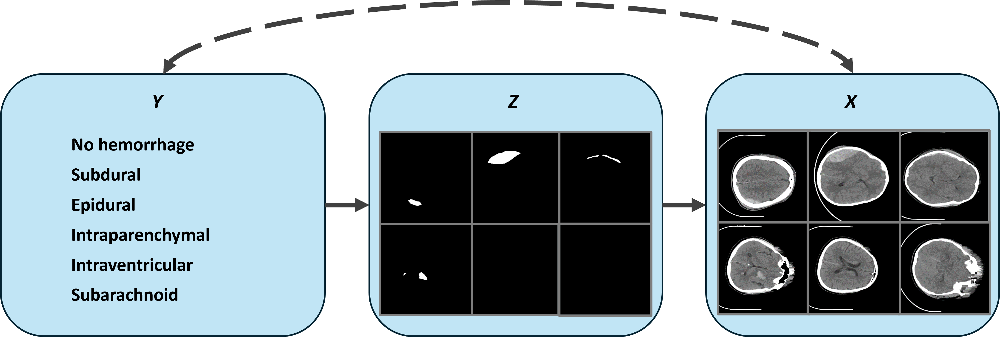
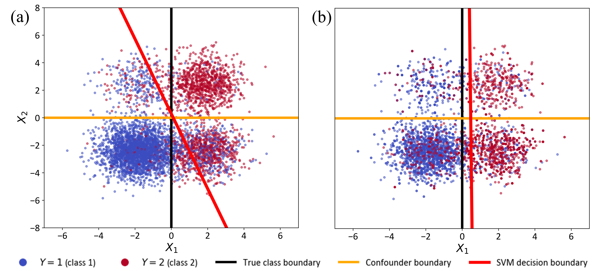

# mechanism-learn [](https://doi.org/10.5281/zenodo.13984553)
Mechanism-learn is a user-friendly Python library which uses front-door causal bootstrapping to deconfound observational data such that any appropriate machine learning (ML) model is forced to learn predictive relationships between effects and their causes (reverse causal inference), despite the potential presence of multiple unknown and unmeasured confounding. The library is compatible with most existing machine learning deployments such as scikit-learn, Keras.

## Mechanism Learning

One of the major limitations of applying ML methods in critical, high-stakes applications such as decision-making in medicine, is their "causal blindness", that is, ML models are, by design, pattern-recognition algorithms which learn potentially spurious, non-causal associations between the feature and target variables. 

<div align="center">
  
</div>

<p align="left"><strong>Figure 1.</strong> Mechanism learning (b) is a novel, simple and widely applicable solution to the problem of reverse causal inference in the presence of multiple unknown confounding, using arbitrary supervised ML algorithms to predict nonlinear effect-cause relationships from potentially high-dimensional effects. The causal scenario is represented by the ubiquitous front-door causal graph (a). There are multiple, unmeasured/unknown confounding paths between $Y$ and $X$ (bi-directed, dashed arrow). The classic causal inference direction is the causal path from $Y$ to $X$ via $Z$ (blue half arrow); reverse causal inference infers causes $Y$ from effects $X$ (red half arrow).</p>


To address the challenge of "causal-blindness" in ML models, mechanism learning provides a solution. a simple method which uses front-door causal bootstrapping to deconfound observational data such that any appropriate ML model is forced to learn predictive relationships between effects and their causes (reverse causal inference), despite the potential presence of multiple unknown and unmeasured confounding. This novel method is widely applicable, the only requirement is the existence of a mechanism variable mediating the cause (prediction target) and effect (feature data), which is independent of the (unmeasured) confounding variables. 

For example, in radiology, there are unique morphological features caused by different diseases which lead to specific patterns in the digital images, while many unmeasured and/or unknown confounders exist such as the imaging device protocol and patient demographics which simultaneously influence both the diagnostic category and the images. The following figure shows a real-world application of intracranial hemorrhage detection using CT scans, where mechanism learning can well fit. So we can apply mechanism learning to force a ML model to learn the causal relationships between the diagnositic category (cause variable) and the corresponding CT scans (effect variable), and thus make causal hemorrhage diagnosis for an input CT scan from a potential patient.

<div align="center">
  
</div>

<p align="left"><strong>Figure 2.</strong> Front-door structural causal model for the real-world ICH dataset [1], for the purposes of mechanism learning. The cause variable $Y$ represents diagnostic category; mechanism variable $Z$ represents hemorrhage region label, and the effect variable $X$ are the digital CT scans.</p>

## Citing

Please use one of the following to cite the code of this repository.

(leave blank for now)

## Installation and getting started

We currently offer seamless installation with `pip`. 

Simply:
```
pip install mechanism-learn
```

Alternatively, download the current distribution of the package, and run:
```
pip install .
```
in the root directory of the decompressed package.

To import the package:
```python
import mechanismlearn as ml
```

## Demo. for classification task

Please refer to other [examples](https://github.com/JianqiaoMao/mechanism-learn/tree/main/test_scr) for detialed instructions and usage demonstrations.

1. Import mechanismlearn lib and other libs for demo.
```python
import numpy as np
import pandas as pd
from distEst_lib import MultivarContiDistributionEstimator
import mechanismlearn as ml
from sklearn import svm
from sklearn.linear_model import LinearRegression
from sklearn.metrics import classification_report, r2_score, mean_squared_error, mean_absolute_error
import matplotlib.pyplot as plt
```

2. Read synthetic classification datasets
```python
syn_data_dir = r"../test_data/simu_data/synthetic_data/"
testcase_dir = r"frontdoor_discY_contZ_contX_discU/"
X_train_conf = pd.read_csv(syn_data_dir + testcase_dir + "X_train_conf.csv")
Y_train_conf = pd.read_csv(syn_data_dir + testcase_dir + "Y_train_conf.csv")
Z_train_conf = pd.read_csv(syn_data_dir + testcase_dir + "Z_train_conf.csv")
X_train_conf = np.array(X_train_conf)
Y_train_conf = np.array(Y_train_conf).reshape(-1,1)
Z_train_conf = np.array(Z_train_conf)

X_test_unconf = pd.read_csv(syn_data_dir + testcase_dir + "X_test_unconf.csv")
Y_test_unconf = pd.read_csv(syn_data_dir + testcase_dir + "Y_test_unconf.csv")
X_test_unconf = np.array(X_test_unconf)
Y_test_unconf = np.array(Y_test_unconf).reshape(-1,1)

X_test_conf = pd.read_csv(syn_data_dir + testcase_dir + "X_test_conf.csv")
Y_test_conf = pd.read_csv(syn_data_dir + testcase_dir + "Y_test_conf.csv")
X_test_conf = np.array(X_test_conf)
Y_test_conf = np.array(Y_test_conf).reshape(-1,1)
```

Here, we have a confounded training set which mimics some observational dataset confounded in front-door criteria. Variables $Y$, $X$ and $Z$ represent the cause, effect and mechanism variables, respectively. Also, there are two test sets, where one is a confounded test set with the same confounding as the confounded training set, and another one is a non-conofunded test set without any confounding between the cause and effect variables.

3.  Train a deconfounded SVM classifier using mechanism learning
```python
clf_deconf, deconf_data = ml.mechanism_classifier(cause_data = {"Y": Y_train_conf}, 
                                                  mediator_data = {"Z": Z_train_conf},
                                                  effect_data = {"X": X_train_conf}, 
                                                  n_bins = [0,20],
                                                  ml_model = svm.SVC(kernel = 'linear', C=5), 
                                                  rebalance = False, 
                                                  n_samples = None, 
                                                  cb_mode = "fast",
                                                  output_data = True)
```

In this toy example, a linear SVM is used. Meanwhile, the default histogram method is used to estimate the required distributions for mechanism learning (specifically, $\hat p\left(z|y\right)$ ). Although the confounded training data is input, mechanism learning will deconfound the given confounded dataset and train the SVM which can make causal predictions. Refer to the reference for more information.

4. Train a confounded SVM classifier
```python
clf_conf = svm.SVC(kernel = 'linear', C=5)
clf_conf = clf_conf.fit(X_train_conf, Y_train_conf.reshape(-1))
```

For comparison, this code segmentation trains a naive SVM which is a confounded model because of the confounded training data.

5. Compare their decision boundaries

```python
weight = clf_deconf.coef_[0]
bias = clf_deconf.intercept_[0]
k = -weight[0] / weight[1]
b = -bias / weight[1]
x_ = np.linspace(-4, 4, 100)
decison_boundary_deconf = k * x_ + b

weight = clf_conf.coef_[0]
bias = clf_conf.intercept_[0]
k = -weight[0] / weight[1]
b = -bias / weight[1]
x_ = np.linspace(-4, 4, 100)
decison_boundary_conf = k * x_ + b
```

```python
fig, axs = plt.subplots(1, 2, figsize=(13, 7))
handles = []
labels = [r'$Y=1$ (class 1)', r'$Y=2$ (class 2)',
          'True class boundary', 'Confounder boundary', 'SVM decision boundary']

# Plot confounded SVM on confounded dataset
ax = axs[0]
scatter = ax.scatter(x=X_train_conf[:, 0], y=X_train_conf[:, 1], c=Y_train_conf, s=10,
                     cmap='coolwarm', alpha=0.5)
handles_scatter, labels_scatter = scatter.legend_elements(prop="colors")
handles += handles_scatter
ax.set_xlim(-7, 9)
ax.set_ylim(-10, 8)
x_ = np.linspace(-8, 8, 100)
true_b = ax.plot([0, 0], [-10, 10], linewidth=4, color="black")
confounder = ax.plot([-10, 10], [0, 0], linewidth=4, color="orange")
clf_b_conf = ax.plot(x_, decison_boundary_conf, linewidth=5, color="red")

handles += [true_b[0], confounder[0], clf_b_conf[0]]
ax.set_title("Confounded SVM decision boundary with confounded dataset")
ax.set_xlabel(r"$X_1$")
ax.set_ylabel(r"$X_2$")

# Plot deconfounded SVM on deconfounded dataset
ax = axs[1]
scatter = ax.scatter(x=deconf_data[0][:, 0], y=deconf_data[0][:, 1], c=deconf_data[1], s=10,
                     cmap='coolwarm', alpha=0.5)
ax.set_xlim(-7, 9)
ax.set_ylim(-10, 8)
x_ = np.linspace(-8, 8, 100)
true_b = ax.plot([0, 0], [-10, 10], linewidth=4, color="black")
confounder = ax.plot([-10, 10], [0, 0], linewidth=4, color="orange")
clf_b_deconf = ax.plot(x_, decison_boundary_deconf, linewidth=5, color="red")

ax.set_title("Deconfounded SVM decision boundary with deconfounded dataset")
ax.set_xlabel(r"$X_1$")
ax.set_yticks([])
fig.legend(handles=handles,
           labels=labels,
           loc='lower center',
           bbox_to_anchor=(0.5, -0.05),
           ncol=5,
           markerscale=2)

plt.tight_layout()
plt.subplots_adjust(bottom=0.15)
plt.show()
```

By running these cells, you may expect to have the output similar to below:

<div align="center">
  
</div>

<p align="left"><strong>Figure 2.</strong> Comparing classifiers trained using (a) classical supervised learning and (b) mechanism learning, on the synthetic classification dataset. With confounded data (a), class 1 samples tend to concentrate in the bottom left region, with class 2 samples in the top right. The SVM classifier's decision boundary mixes the true with the confounding boundary. By contrast, after applying front-door CB (b) the confounding factor has been nullified, such that the SVM decision boundary is close to the true class boundary.</p>


The confounded SVM, trained using classical supervised learning, is severely affected by the confounder, whose decision boundary conflates the true class with the implied confounder boundaries. By contrast, the decision boundary of the deconfounded SVM closely matches the true class boundary which nullifies the influence of the confounder. Therefore, the deconfounded SVM, trained using mechanism learning, captures the desired causal relationship between features and prediction target.

6. Compare their performance in evaluation metrics on confounded and non-confounded test sets

```python
print("Test on the non-confounded test set:")
y_pred_deconf_unconf = clf_deconf.predict(X_test_unconf)
print("Report of de-confonded model:")
print(classification_report(Y_test_unconf, y_pred_deconf_unconf))

print("-"*20)
y_pred_conf_unconf = clf_conf.predict(X_test_unconf)
print("Report of confonded model:")
print(classification_report(Y_test_unconf, y_pred_conf_unconf))

print("*"*30)
print("Test on the confounded test set:")
y_pred_deconf_conf = clf_deconf.predict(X_test_conf)
print("Report of de-confonded model:")
print(classification_report(Y_test_conf, y_pred_deconf_conf))

print("-"*20)
y_pred_conf_conf = clf_conf.predict(X_test_conf)
print("Report of confonded model:")
print(classification_report(Y_test_conf, y_pred_conf_conf))
```

The expected output should be similar to:

```output
Test on the non-confounded test set:
Report of de-confonded model:
              precision    recall  f1-score   support

           1       0.72      0.86      0.79       362
           2       0.91      0.81      0.86       638

    accuracy                           0.83      1000
   macro avg       0.82      0.84      0.82      1000
weighted avg       0.84      0.83      0.83      1000

--------------------
Report of confonded model:
              precision    recall  f1-score   support

           1       0.65      0.86      0.74       362
           2       0.90      0.74      0.81       638

    accuracy                           0.78      1000
   macro avg       0.78      0.80      0.78      1000
weighted avg       0.81      0.78      0.79      1000

******************************
Test on the confounded test set:
Report of de-confonded model:
              precision    recall  f1-score   support

           1       0.89      0.88      0.88       632
           2       0.79      0.82      0.81       368

    accuracy                           0.86      1000
   macro avg       0.84      0.85      0.85      1000
weighted avg       0.86      0.86      0.86      1000

--------------------
Report of confonded model:
              precision    recall  f1-score   support

           1       0.89      0.88      0.88       632
           2       0.80      0.81      0.80       368

    accuracy                           0.85      1000
   macro avg       0.84      0.84      0.84      1000
weighted avg       0.85      0.85      0.85      1000
```

In terms of performance evaluation metrics the SVM trained using mechanism learning, exceeds the SVM trained using classical supervised learning on the non-confounded dataset by 5% accuracy, retaining stable predictive accuracy across both confounded and non-confounded datasets. On the contrary, although the classical supervised SVM performs about as well as the deconfounded SVM in the confounded dataset, its performance declines significantly on the non-confounded dataset. This is because classical supervised learning is biased by the influence of confounding, reporting misleading accuracy on the original (confounded) test set.

### Reference

**[1]** Hssayeni, M. (2020). [Computed Tomography Images for Intracranial Hemorrhage Detection and Segmentation (version 1.3.1)](https://doi.org/10.13026/4nae-zg36). PhysioNet.
